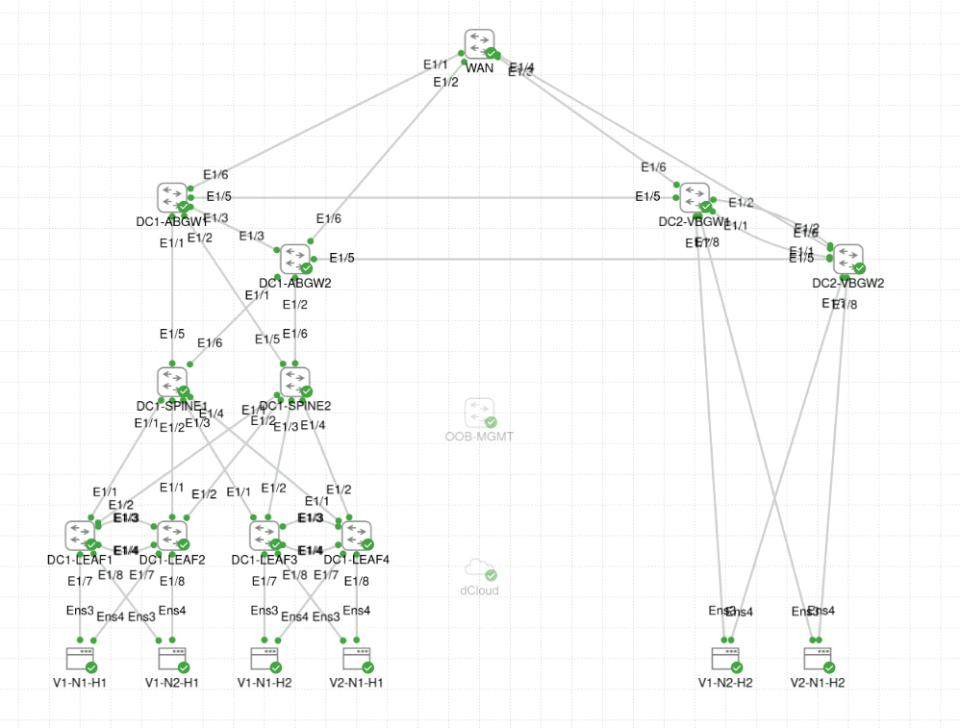
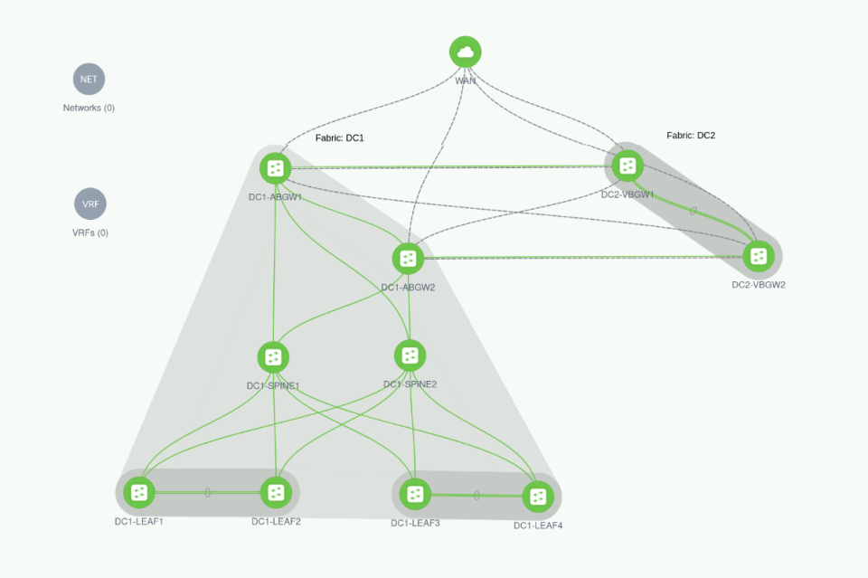

# dCloud-NDFC-CML2-VXLAN-MSF-D1

dCloud Custom Demo for NDFC/CML2 
Pre-built VXLAN Multi-Site Fabric Day 1
- 2 DC sites built using Nexus 9300v (10.3(1)F)
  - DC1 - 4 Leaves, 2 Spines, 2 Anycast BGWs, 4 Ubuntu hosts
  - DC2 - 2 vPC BGWs, 2 Ubuntu hosts
- Ubuntu hosts are connected using LACP port-channels
- WAN (N9Kv) router for VRF-lite peering
  - Link templates pre-configured
- No VRFs, Networks configured
- Terraform/Ansible deployed to Jumphost

